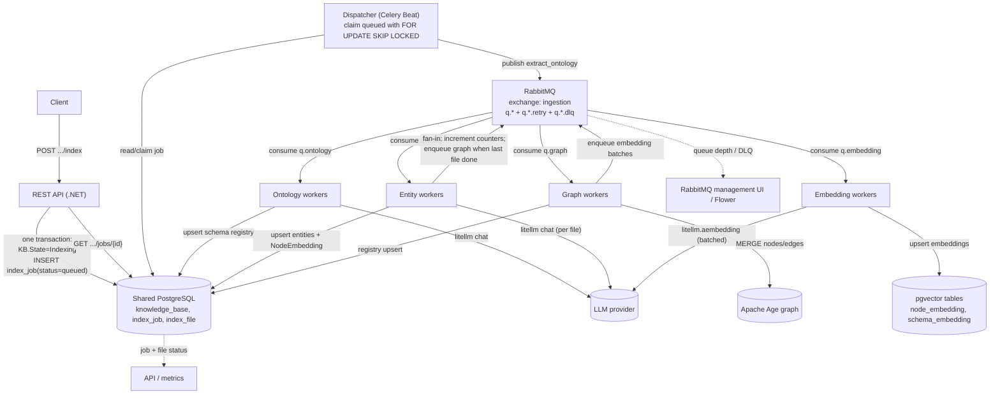
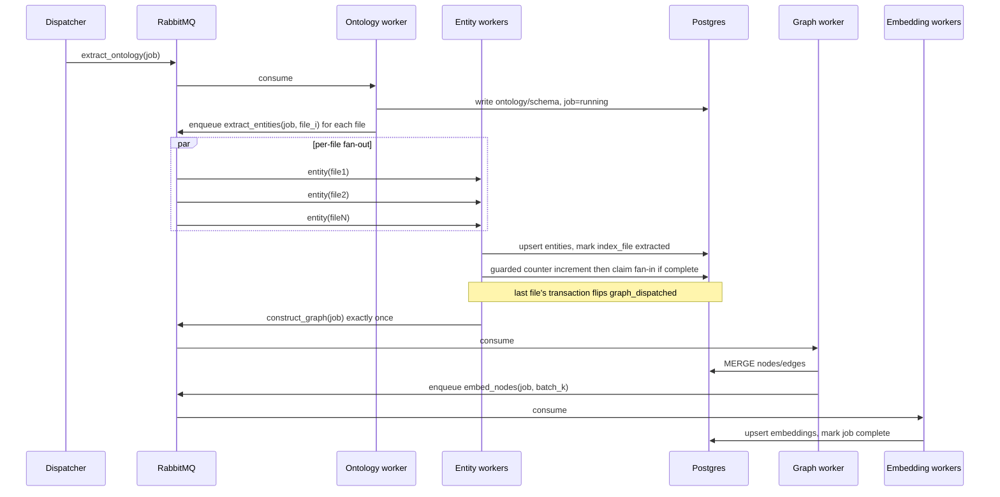
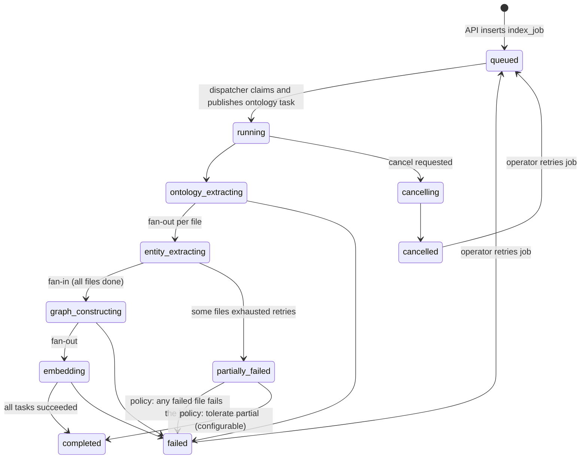

# 5. Ingestion pipeline architecture: RabbitMQ + Celery with a Postgres-backed orchestration layer

## Status

Proposed. Nothing in this ADR is implemented. The current ingestion path is a single-pass script
(`src/ingestion-worker/src/ingestion_worker/__init__.py`) and the API only flips a state column
(`KnowledgeBasesController.PublishKnowledgeBase`); there is no broker, worker pool, scheduler or
workflow engine anywhere in the repository (see "Findings" below). This ADR decides the shape of the
asynchronous indexing pipeline and the state model the API and the ingestion worker will share.

## Context

### What exists today (verified)

- **Management API** — ASP.NET Core (net10.0) at `src/api/GraphPlatform.Api`. It owns the
  `knowledge_base` table (`Models/KnowledgeBase.cs`, `Data/AppDbContext.cs`) with a coarse
  `KnowledgeBaseState` enum of `Draft`, `Indexing`, `Published`. `POST
  /api/organizations/{organizationId}/knowledge-bases/{knowledgeBaseId}/publish` changes a draft to
  `Indexing` and returns `200` with the Knowledge Base DTO. Its own comment states the truth:
  *"worker dispatch and completion are not wired yet."* There is **no** `POST .../index` endpoint,
  **no** `index_job`/`index_file` table, and **no** `BackgroundService`/`IHostedService`.
- **Ingestion worker** — Python uv project at `src/ingestion-worker`. `run()` is a one-shot
  script: it reads a JSON file path from `DEMO_KNOWLEDGE_BASE_PATH`, opens one Apache Age connection
  plus one SQLAlchemy engine, creates tables/indexes, and calls
  `KnowledgeBaseService.upsert_knowledge_base()` once. `pipeline.py` is a 19-line stub whose
  `_read`/`_transform`/`_load` bodies are all `pass`. There is no ontology extraction, entity
  extraction, or multi-file concept anywhere.
- **Shared library** — `common` (Python) holds the schemas, ORM models, `AgeGraphRepository`,
  `KnowledgeBaseService`, and `EmbeddingService`. `KnowledgeBase` (`schemas/knowledge_base.py`) is a
  flat `nodes` + `relationships` graph; it has **no** `files`, `ontology`, or `entities` field.
- **Storage** — one PostgreSQL instance shared by both stacks. Apache Age provides the graph
  (`ag_catalog`), pgvector provides embeddings (`graph_registry`, `node_embedding`,
  `schema_embedding`, all dimensionless per ADR-0003). EF owns `organization`, `user_organization`,
  `model_config`, `knowledge_base` and Identity's `AspNet*` tables; Python's
  `Base.metadata.create_all` owns the three embedding/registry tables. The two owners are
  deliberately kept disjoint (`AppDbContext` ignores the Python tables).
- **LLM/embedding calls** — `EmbeddingService.compute_embeddings()` calls `litellm.aembedding()`;
  `agent_runtime.chat_model.build_chat_model()` builds a `ChatLiteLLM`. Provider config is a
  `Model` row/`ModelConfig` table plus `configs/*.yaml`. There is **no** retry, backoff, throttling,
  batching or concurrency control around any provider call.
- **Observability** — ASP.NET's default logging levels only (`README.md`); Python uses no logging,
  metrics, or tracing. There is no job/task visibility surface beyond the `knowledge_base.State`
  column.
- **Deployment** — no Docker, no compose, no CI, no infrastructure-as-code. Only `configs/*.yaml`.
  There is no managed-service dependency anywhere.

### What the indexing workload is required to become

1. Ontology extraction.
2. Entity extraction, fanned out per file.
3. Knowledge graph construction, after all entity extraction for the job completes.
4. Vector embedding calculation, fanned out over whatever is embedded.

Each Knowledge Base may contain multiple files; indexing is long-running; tasks must be independently
retryable and recoverable; overall job and per-file status must be trackable; the API must return
quickly; the pipeline must evolve.

### Gap between the two

The four stages, the file concept, and job/file state **do not exist**. The ontology/entity stages
are a proposed future capability, not a refactor of existing code. This ADR treats the pipeline as
new construction and is explicit about which pieces are existing and which are proposed.

## Decision Drivers

- **Asynchronous acceptance.** The API must commit an indexing request and return immediately, and
  must not call the worker directly.
- **A dependency DAG with fan-out/fan-in.** Ontology gates per-file entity extraction, which gates
  graph construction, which gates embedding — the classic fork/join shape.
- **Durability and recovery.** Worker crashes, process restarts and infrastructure outages must not
  lose or corrupt a long-running job; work must resume rather than restart from zero where possible.
- **Independent retryability.** A failed file or provider call retries without redoing the whole job.
- **First-class cancellation and timeouts.** An operator must be able to cancel a running job; a hung
  provider call must not pin a worker forever.
- **Observable progress.** Job-level and file-level status must be queryable by the API.
- **Evolvability.** Stages will be added/reordered; the orchestration must not require a rewrite each
  time.
- **Rate-limit discipline.** External LLM/embedding providers are shared, billed, and rate-limited.
- **Idempotency.** Retries must not duplicate graph nodes/edges or embeddings.
- **Fully self-hostable and proportionate.** The project is at 0.1.0, pre-production, with no CI or
  deployment automation. Every new component must be self-hostable on the team's own infrastructure
  and justified against a low operational bar.

## Options Considered

### Option 1 — RabbitMQ + Celery

**Architecture.** RabbitMQ is the broker. Celery workers consume per-stage queues. Celery's canvas
(`chain`, `group`, `chord`) expresses the DAG; a result backend holds task results and chord
counters. A thin Postgres-backed job/file state machine (this ADR's addition) is the source of truth.

**Advantages.** Mature, widely deployed, fully self-hostable Python stack; per-stage queues and
worker pools are first-class; task-level retries and `acks_late` exist; RabbitMQ gives dead-letter
exchanges, per-queue backpressure and a management UI; the team's operational model (Docker images
for a broker + workers) is simple and well documented. No managed service, no new language runtime.

**Disadvantages.** The *coordination* state is not durable in the way a workflow needs: a chord is
best-effort (the fan-in callback can be lost or double-fire, and depends on a result backend), there
is no native cancel-the-whole-DAG, no native per-workflow visibility, no durable timers without
Celery Beat, and resumability after a broker/result-backend loss means reconstructing the DAG from
application state. The result backend becomes a second state store to reconcile — so this ADR does
**not** rely on chords for the fan-in.

**Fit.** Strong for task execution and fan-out, which is most of the pipeline. The one gap —
reliable fan-in and recovery — is closed with a small Postgres orchestration layer rather than with
chords. This is the selected option.

### Option 2 — Kafka + Python consumers

**Architecture.** Stages publish events to Kafka topics; consumer groups process per stage; the DAG is
encoded by which topic a consumer writes to next.

**Advantages.** Durable, replayable log; high throughput; per-partition ordering; multiple
independent consumers.

**Disadvantages.** Kafka is an *event streaming* platform. This workload is not a stream: it has a
finite completion, a dependency DAG, and no requirement for replay, stream windows, or independent
fan-out of the same event to many consumers. Kafka does not orchestrate dependencies — the DAG would
still need a workflow layer on top. Operationally it is the heaviest option and a JVM cluster to
self-host.

**Fit.** Wrong paradigm. Rejected.

### Option 3 — RabbitMQ + a dedicated workflow/orchestration layer

**Architecture.** RabbitMQ carries tasks; a purpose-built orchestrator (typically a state machine
persisted in Postgres) owns the DAG, fan-out/fan-in counters, retries, timers, and cancellation.

**Advantages.** Reuses the one durable store already present (PostgreSQL); full control; no new
heavyweight runtime beyond the broker; the orchestrator's state is queryable by the API because it
lives in the shared DB; fully self-hostable.

**Disadvantages.** Every workflow-engine concern (durable timers, exactly-once-ish fan-in,
cancellation, versioning of running workflows, retry/DLQ policy, recovery semantics) is our code to
get right.

**Fit.** This is effectively where the decision lands, but *sized small*: Celery remains the task
execution and transport layer, and the "orchestration layer" is not a separate service — it is a
handful of guarded SQL transitions on the `index_job`/`index_file` tables, plus a dispatcher. We
build only the coordination we actually need (the fan-in counter and the stage transitions), not a
general workflow engine.

### Option 4 — Temporal

**Architecture.** Workflows are code whose execution state is durably persisted by Temporal Server
and replayed after any crash. Activities are the side-effecting units, each with its own retry
policy, timeout and heartbeat. Task queues route activities to independently scaled worker pools.

**Advantages.** Durable orchestration by construction; native fan-out/fan-in; native retry, timeout,
heartbeat, backoff and cancellation; visibility UI; workflow versioning. Technically the best fit for
the stated long-running/fan-out/fan-in requirements.

**Disadvantages.** A second distributed runtime to operate (Temporal Server + its own persistence),
a determinism-constrained programming model, cross-language versioning between the .NET API and
Python workers, and a deployment story that realistically points at Temporal Cloud or a self-hosted
cluster with its own database and upgrade cadence. That is disproportionate for a pre-production
project with no deployment automation, and it is the one option that most pushes the team away from
a simple self-hosted stack.

**Fit.** The stronger long-term orchestration tool, but rejected *at this stage* on operational
proportionality and self-hostability, not on capability. See "Future considerations" for the
migration trigger and path.

### Option 5 — Existing messaging/workflow infrastructure

**Architecture.** Extend whatever is already present.

**Finding.** There is **none**. The only durable infrastructure is the shared PostgreSQL instance
(plus Apache Age and pgvector running inside it). There is no broker, no queue table, no scheduler,
no hosted service. So "extend existing" reduces to "use PostgreSQL as the durable store" — which the
selected option does. This option cannot carry task transport on its own.

## Decision

**Adopt RabbitMQ as the broker and Celery as the task execution framework, backed by a thin
PostgreSQL orchestration/state layer that is the single source of truth for job and file state.**

Concretely:

- **RabbitMQ** is the only new infrastructure component. It is self-hostable, has a small
  operational surface (one broker + management UI), and needs no managed service.
- **Celery** transports and executes the four stage tasks over per-stage queues. It provides
  fan-out, retries with backoff, `acks_late` redelivery, worker pools and per-task rate limits.
- **PostgreSQL** (already present and shared by both stacks) stores `index_job`/`index_file` and
  provides the **fan-in and stage transitions**. Celery chords are deliberately **not** used for the
  fan-in: the fan-in is a guarded count in Postgres, so a lost or duplicated Celery signal cannot
  skip or double-run graph construction.
- **No result backend is required** because the pipeline never reads Celery task return values — all
  durable state lives in the `index_job`/`index_file` tables (`task_ignore_result = True`). This
  keeps the stack to RabbitMQ + Celery + Postgres, with no Redis/broker-and-backend pair.
- **The API never calls a worker.** It writes an `index_job(status=queued)` row in the publish
  transaction; a small **dispatcher** (a Celery Beat periodic task) claims queued jobs with
  `SELECT ... FOR UPDATE SKIP LOCKED` and publishes the first stage task.

The pipeline is an **asynchronous, long-running, fan-out/fan-in workflow**, not text-book event
streaming. That classification drives the choice:

- It is **not event streaming**: there is one logical consumer per stage transition, work is finite
  and request-scoped, and no replay/stream-processing semantics are required. Kafka is rejected on
  paradigm, not on popularity.
- It is **not merely a task queue**: plain Celery would leave the fan-in, cancellation, resumability
  and stage transitions to us. Those are therefore modelled explicitly in the `index_job`/`index_file`
  state machine, which is the minimum orchestration the requirements demand.
- It **is** a workflow, and the selected architecture meets that with Celery for execution plus a
  deliberately small Postgres state machine for coordination — rather than an external workflow
  engine.

### Job model vs event model

The workload is **asynchronous job processing plus a DAG of dependent tasks**. It is explicitly *not*
event streaming. Concretely: the unit of work is a single indexing request for one Knowledge Base;
it terminates in `completed`/`failed`/`cancelled`; its internal edges are dependencies (a partial
order), not events to be observed by multiple consumers. "Many files" is fan-out *within one job*,
which is a concurrency dimension, not a streaming one. This distinction is what rules out Kafka
regardless of file volume.

### How the API reaches the worker without calling it

The required boundary is `REST API → message queue → ingestion worker`. It is satisfied by the
transactional-outbox shape:

1. **Recommended.** In the publish transaction, the API sets `knowledge_base.State = Indexing` and
   inserts an `index_job` row with `status = queued`. A **dispatcher** (Python, deployed with the
   workers, typically a Celery Beat task) picks up `queued` jobs and publishes
   `extract_ontology(job_id)` to RabbitMQ. The API has no Celery/RabbitMQ dependency; the queue
   boundary is the durable `index_job` row plus RabbitMQ. A dispatcher retry cannot start a second
   pipeline because claiming the job is a guarded, idempotent SQL update.
2. **Rejected as the default.** The API uses the RabbitMQ .NET client to publish the first task
   directly. This preserves the async boundary and removes the dispatcher, but couples the .NET
   service to the message contract and splits the producer role across two languages. It is a
   reasonable simplification to revisit later.

## Architecture



Fan-out/fan-in, explicitly:



Workflow dependency and state transitions (proposed):



**Existing vs proposed.** The API, `knowledge_base`, the graph and embedding tables, and the
`KnowledgeBaseService` write path all exist. RabbitMQ, Celery, the dispatcher, the four worker pools,
the ontology/entity stages, the file concept, and `index_job`/`index_file` are **proposed**.

## Queue / Workflow Design

### Topology (RabbitMQ + Celery)

One topic exchange `ingestion` with one routing key per stage into per-stage queues. Retry and
dead-letter variants per stage:

| Queue | Routing key | Worker pool | Purpose |
|---|---|---|---|
| `q.ontology` | `ingestion.ontology` | Ontology workers | One task per job |
| `q.entity` | `ingestion.entity` | Entity workers | Fan-out, one task per file |
| `q.graph` | `ingestion.graph` | Graph workers | One task per job, after fan-in |
| `q.embedding` | `ingestion.embedding` | Embedding workers | Batched fan-out |
| `q.<stage>.retry` | — | (none) | TTL + dead-letter back to `q.<stage>` for durable delayed retries |
| `q.<stage>.dlq` | — | (none / inspection) | Terminal failures after max retries; mirrors `index_file.error` |

Separate queues per stage are the topology (not one queue) because each stage has a distinct
resource/rate-limit profile and must scale independently. Retry and dead-letter are queue
configurations, not extra stages.

### Message/task payloads

Payloads are small, JSON-serializable identifiers — never large content. The graph JSON stays in the
`knowledge_base.Data` jsonb column (the worker reads it by id); extracted entities/ontology are
persisted to tables keyed by `index_job`/`index_file`, not carried in messages. Recommended shapes:

- `extract_ontology`: `{ job_id, organization_id, knowledge_base_id, graph_name }`
- `extract_entities`: `{ job_id, file_id }`
- `construct_graph`: `{ job_id }`
- `embed_nodes`: `{ job_id, batch_id }` (a batch of node ids, to respect provider batch limits)

The job/file rows are the join point: a task reads the current row by id and writes results back
keyed by the same id. This keeps payloads idempotent and re-drivable.

### Producers, consumers, acknowledgement

- **Producer.** The API produces a durable `index_job` row; the dispatcher produces the first task.
  Workers only produce the *next* stage's task (never API calls).
- **Consumers.** The four worker pools consume their queues.
- **Acknowledgement.** Celery runs with `task_acks_late = True` and
  `task_reject_on_worker_lost = True`, so a task is acked only after it succeeds and a killed worker
  causes redelivery. Combined with RabbitMQ's manual ack, this is the at-least-once semantics
  long-running jobs need. Tasks must therefore be idempotent (see "Idempotency").
- **Prefetch.** `worker_prefetch_multiplier = 1` for these long tasks so one worker does not hoard
  messages and starve other workers.

### Retry, backoff, dead-letter

- **Retries** are per-task: exponential backoff with jitter, a bounded maximum attempt count, and an
  explicit non-retryable-error classification (e.g. malformed file → no retry; provider 429/5xx →
  retry). Each `index_file.attempts` is incremented and `error` recorded on every failure.
- **Backoff mechanism.** Prefer a durable TTL+DLX retry queue (`q.<stage>.retry` with a per-message
  TTL that dead-letters back to `q.<stage>`) over Celery's in-worker `countdown`/ETA retries, because
  ETA retries live in worker memory and are lost if that worker dies. Celery's `self.retry()` is the
  ergonomic wrapper; the TTL+DLX queue is what makes the delay crash-safe.
- **Dead-lettering.** After the maximum attempts, the task is routed to `q.<stage>.dlq`; the worker
  marks the `index_file` (or job) failed and applies the partial-failure policy. `index_file.error`
  and `attempts` remain the durable dead-letter record the API reads.
- **No whole-job automatic retry** — a failed job is retried by operator action (re-queue), so a
  permanent failure does not loop forever.

### Fan-out and fan-in (the core of the design)

- **Fan-out** is plain Celery: the ontology task publishes one `extract_entities(job_id, file_id)`
  per file, or a `group` of them. These run concurrently across the entity worker pool.
- **Fan-in is a guarded Postgres count, not a Celery chord.** Each entity task, in the same
  transaction that finalizes its `index_file` row, atomically claims the right to advance:

  ```sql
  UPDATE index_job
     SET processed_files = processed_files + 1,
         failed_files    = failed_files    + :failed
   WHERE id = :job_id;

  UPDATE index_job
     SET graph_dispatched = true
   WHERE id = :job_id
     AND graph_dispatched = false
     AND processed_files + failed_files >= total_files
  RETURNING id;
  ```

  A row returned by the second statement means *this* task is the one that enqueues
  `construct_graph(job_id)` — exactly once, even under redelivery. This is why Celery chords are not
  used: the fan-in is durable, atomic and observable in Postgres, and a duplicate/lost task
  notification cannot skip or double-run graph construction. The `graph_dispatched` flag is the
  fan-in gate; it is reset when a job is retried.

### Concurrency, rate limiting, ordering

- **Concurrency** is bounded per worker pool (`celery worker --concurrency=N --queues=q.<stage>`),
  sized to the provider's limit and the machine's CPU/memory. This is the primary throttle.
- **Rate limiting** has two layers: Celery's per-task `rate_limit` (simple, but **per worker pool**
  and reset on restart) and a shared provider token-bucket in Postgres (or RabbitMQ-based) keyed by
  provider (and optionally organization) for a true global cap across all workers. The shared limiter
  is what protects a provider quota; the per-task limit is a cheap first line.
- **Ordering** is enforced only where it is real: the guarded fan-in gate *is* the ordering
  guarantee before graph construction. Within a stage there is no ordering requirement, so fan-out is
  fully concurrent. Embedding batches are independent.
- **Backpressure** is RabbitMQ queue depth plus bounded worker concurrency; the API never blocks
  because it only writes a row.

## Job State Model

### Durable application state (source of truth for the API)

The API already has `knowledge_base.State` (`Draft`, `Indexing`, `Published`). Keep it coarse and
user-facing; it answers "is this Knowledge Base usable?" Add `Failed` (and optionally `Cancelled`) to
that enum, or derive it from the latest job. The detailed lifecycle lives in two new tables.

Recommended minimum schema (close to the prompt's suggestion, trimmed to what is needed):

```
index_job
  id                    string  PK            -- stable job id; dedupes dispatch and retries
  organization_id       string  indexed
  knowledge_base_id     string  indexed
  graph_name            string               -- resolved target graph
  status                enum    queued|running|completed|partially_failed|failed|cancelled
  total_files           int
  processed_files       int
  failed_files          int
  graph_dispatched      bool                 -- fan-in gate; true once graph task enqueued
  embedding_model_id    string               -- provenance of the model used (ADR-0001/0002)
  requested_by          string               -- user id, for audit
  error                 text    null
  created_at / started_at / completed_at
```

```
index_file
  id                    string  PK
  index_job_id          string  FK -> index_job, indexed
  file_id               string               -- stable id from the Knowledge Base
  status                enum    pending|extracting|extracted|failed|skipped
  attempts              int
  error                 text    null
  started_at / completed_at
```

Notes on the recommended changes:

- **`total_files`/`processed_files`/`failed_files` are denormalized counters**, not derived on every
  read, because the API polls them and because the fan-in guard reads them. They are updated by the
  worker in the same transaction as the corresponding `index_file` update. `graph_dispatched` is the
  one-shot fan-in gate.
- **`index_job.id` is the dedupe key** for dispatch and retries; the guarded `UPDATE ... RETURNING`
  makes every transition safe to repeat.
- **The `files` concept is new and is a prerequisite.** Today `KnowledgeBase` is a flat node/edge
  graph with no files. Introducing per-file extraction requires the Knowledge Base payload (and/or a
  companion table) to enumerate files. That is a separate schema change this ADR depends on but does
  not fully specify — see Open Questions.
- **`index_file` is the business record**, queried by the API; there is no separate workflow store to
  reconcile, which is the simplification this option buys over an external engine.

### Distinguishing the four kinds of state

| Kind | Lives in | Authority | Survives |
|---|---|---|---|
| **Durable application state** | Postgres `knowledge_base`, `index_job`, `index_file` | The API and workers; the source of truth for status | Everything except DB loss |
| **Queue state** | RabbitMQ queues (ready/unacked messages) | RabbitMQ; transient dispatch state, never authoritative | Broker restart (durable queues), but never read as status |
| **Workflow/orchestration state** | Postgres (`index_job`/`index_file` counters and status) | Our state machine; source of truth for progress, fan-in, retries | Everything except DB loss |
| **Transient worker state** | Process memory | No one | Nothing; must be reconstructible from the DB and payload |

The rule: **never answer a status question from queue state**, and **never treat RabbitMQ depth as
the business record**. The API reads Postgres; RabbitMQ only moves work.

### Table ownership across the two stacks (a real decision)

The `index_job`/`index_file` tables are written by the API (create) and by Python workers (status
updates). This crosses the current clean ownership split. Recommendation:

- **EF/API owns the DDL** (an EF migration), because job lifecycle is management state and the API
  already owns `knowledge_base`; the API is the component serving status reads.
- **The Python worker updates status through a narrow `common` data-access module using parameterized
  SQL / SQLAlchemy Core**, *without* registering SQLAlchemy ORM models on `Base.metadata`. Because no
  model is registered, `Base.metadata.create_all` never creates, alters, or drops these tables — the
  existing "two owners, disjoint DDL" invariant holds.

This is a deliberate trade-off (Python loses ORM convenience for these two tables) and is called out
as an Open Question because the team may prefer to put the tables in `common` instead.

## Failure and Recovery

### Idempotency (concrete, from the existing storage model)

At-least-once delivery (`acks_late`, redelivery after a killed worker) makes task idempotency a hard
requirement. The current code is **not** retry-safe, and the fix is required before any retry is
enabled:

- **Ontology extraction** — writes to `GraphSchemaRegistry`, whose `upsert_records()` merges by the
  match key `(organization_id, graph_name, type, name)`. **Already idempotent.** Retrying is safe.
- **Entity extraction** — produces nodes. `KnowledgeNode.ensure_id()` *auto-generates a UUID when
  `id` is omitted*, so a retried extraction would fabricate new ids and duplicate every entity.
  **Not idempotent today.** Fix: derive deterministic ids from stable inputs (e.g. UUIDv5 over
  `organization_id + graph_name + knowledge_base_id + file_id + entity natural key`) so a retry
  produces the same id.
- **Graph construction** — `AgeGraphRepository.create_node()` issues Cypher `CREATE` and
  `create_relationship()` issues `MATCH ... CREATE`. **Neither is idempotent**: a retry duplicates
  nodes and edges. Fix: switch the write path to `MERGE` on the app-level `id` property (the
  repository already has `update_node`/`update_relationship` using `MATCH ... SET`, but no `MERGE`),
  or make graph construction a scoped replace (delete the job/file's nodes, then write) using the
  existing `NodeEmbedding`-derived node ids. `MERGE` on a deterministic id is the recommended path
  because it composes with per-file retries.
- **Embedding** — `NodeEmbedding` has `UniqueConstraint(organization_id, graph_name,
  knowledge_base_id, node_id)` and an upsert; `SchemaEmbedding` is a 1:1 upsert keyed by
  `graph_registry_id`. **Idempotent, provided node ids are deterministic** (the entity-extraction
  fix). The `GraphSchemaRegistry.upsert_records()` side-table traps documented in
  `AGENTS.md`/`CLAUDE.md` (assign `embedding_row = None` before `session.add()`; mutate an existing
  child in place) must be respected.

**Recommended idempotency keys:** the guarded `index_job`/`index_file` transitions for orchestration;
`(organization_id, graph_name, knowledge_base_id, file_id, entity_natural_key)` for node identity;
the existing `NodeEmbedding` unique constraint for embedding rows; the existing schema-registry match
key for schema rows.

### Behavior matrix

| Failure | Behavior |
|---|---|
| Individual file fails transiently | Entity task retries (TTL+DLX backoff); `index_file.attempts` increments; job continues |
| Individual file fails permanently (parse error) | Non-retryable classification; task goes to DLQ; `index_file.status = failed`, error recorded; job policy decides partial vs. failed |
| Transient LLM/provider failure | Task retries with exponential backoff + jitter; shared rate limiter prevents stampede |
| Worker crash mid-task | `acks_late` + `task_reject_on_worker_lost` redeliver the unacked message; idempotent write makes the redo safe |
| Worker crash between side effect and status write | Redelivery re-runs the task; idempotency makes the repeat harmless; status is written as the last step |
| Broker (RabbitMQ) outage | Publishing and consuming pause; workers reconnect. Durable queues retain ready messages; `index_job` rows are untouched. The API is unaffected because it only writes a row |
| Database outage | Tasks fail and retry; job status cannot advance until the DB returns; RabbitMQ retains the work |
| Graph (Apache Age) outage | Graph task fails and retries; embedding tasks are gated behind the fan-in, so they are not dispatched yet |
| Vector (pgvector) outage | Same PostgreSQL as the graph in this deployment, so it is the DB-outage case; embedding task retries |
| Partially completed job | `index_job.status = partially_failed` when at least one file is failed and at least one succeeded; whether the job is `failed` or `completed` is a configurable policy. The KB is not `Published` while any file is failed |
| Cancellation | `POST .../cancel` sets a `cancelled` flag on `index_job`; workers check it at task start and between LLM batches; Celery `control.revoke(task_id, terminate=True)` is a best-effort immediate stop. Remaining files marked `skipped`, `index_job.status = cancelled`, `knowledge_base.State` back to `Draft` |
| Dispatcher crash | The periodic dispatcher re-runs; claiming uses `FOR UPDATE SKIP LOCKED` so it resumes without duplicating a pipeline |

### Job status transitions

`queued → running → (ontology_extracting → entity_extracting → graph_constructing → embedding) →
completed` with side exits to `failed`, `partially_failed`, `cancelled`, and a re-entry to `queued`
on operator retry. See the state diagram above. The coarse `knowledge_base.State` is
`Draft → Indexing → Published`, gaining `Failed` (and/or `Cancelled`) so a client can distinguish
"never indexed" from "indexing failed."

## Scaling Strategy

Each stage is an independent Celery worker deployment consuming its own queue, so scaling is
per-stage and independent:

| Stage | Bottleneck | Scale signal | Notes |
|---|---|---|---|
| Ontology | LLM chat tokens; one task/job | `q.ontology` depth | Low parallelism per job (single task); scale with concurrent jobs |
| Entity | LLM chat tokens; per-file tasks | `q.entity` depth / provider 429s | Highest parallelism; the shared rate limiter is the real ceiling |
| Graph | DB writes / Apache Age | `q.graph` depth | CPU/IO-bound; no LLM; scale modestly; batch writes |
| Embedding | Embedding provider quota; batch size | `q.embedding` depth | Batch by provider limit; GPU is the provider's, not ours |

Resource profiles differ (LLM-bound vs. DB-bound vs. provider-quota-bound), which is the concrete
reason not to run one undifferentiated worker pool. Because workers are just Python processes
(`celery worker --queues=...`), each stage can be scaled, restarted and given a different
container size independently; there is no separately deployed orchestration service to scale.

## LLM / Provider Rate Limits

- **Concurrency limits.** Bound per-pool `--concurrency` and cap per-provider in-flight calls with a
  shared limiter; ontology/entity/embedding must draw on one budget per provider because they share
  the same external quota.
- **Retries and backoff.** Treat HTTP 429 and 5xx as retryable with exponential backoff + jitter;
  treat 4xx validation errors as non-retryable. Celery's `autoretry_for`/`self.retry` plus the
  TTL+DLX retry queue does this.
- **Throttling.** A token-bucket keyed by `(provider, organization)` enforces both provider limits
  and per-tenant fairness; it must be shared across worker processes (a DB-backed limiter), not
  in-process only, because Celery's own `rate_limit` is per-pool and resets on restart.
- **Cost control.** Log token/usage per task; record the embedding model id per job
  (`index_job.embedding_model_id`) for provenance and cost attribution (ADR-0001/0002); batch
  embedding calls; never retry a non-retryable provider error.
- **Batching.** Embedding is batched to the provider's max batch size; entity extraction batches
  files only within a worker's concurrency, not into one giant call (to keep per-file retryability).

The current code has **none** of this: `EmbeddingService.compute_embeddings()` is a single
unretried `litellm.aembedding()` call. The limiter/retry layer is new and belongs in the Celery task
wrapper, not in `common`'s pure provider call.

## Observability

- **Logs.** Structured logs from each task, correlated by `index_job.id` / `file_id`; log the Celery
  `task_id` too. The API and workers must emit the same correlation ids. (Today: default ASP.NET
  levels; no Python logging.)
- **Metrics.** Per-stage task duration, success/failure counts, retry counts, queue depth, provider
  latency and 429 rate, tokens/cost, and per-job file progress. Export via a standard metrics
  endpoint.
- **Tracing.** OpenTelemetry spans across API → dispatcher → Celery task → provider call, so one job
  is one trace. Celery's signal hooks carry the correlation id through the queue.
- **Job-level visibility.** `index_job` + a `GET .../jobs/{jobId}` endpoint.
- **Task-level visibility.** `index_file` rows; **Flower** (self-hostable) and the RabbitMQ
  management UI for queue depth and DLQ inspection.
- **Alerts.** Job stuck in `running` beyond a threshold; DLQ depth > 0; failed-file rate above
  baseline; provider 429/5xx spike; dispatcher lag (queued jobs not started); RabbitMQ or workers
  unavailable.

## Security

- **Authentication/authorization.** Starting/cancelling an index is a Contributor/Organization Admin
  action, consistent with the existing Knowledge Base publish rule; reading job status is available
  to any organization member. Workers and the dispatcher are internal and not publicly exposed; they
  authenticate to RabbitMQ, not to end users.
- **Secrets.** Provider keys continue to resolve through the existing conventions (`api_key_env` →
  environment variables for Python; `appsettings.Development.json`/env vars for .NET). The RabbitMQ
  user/password (or TLS client certs) and any DB credentials are new secrets and must follow the same
  no-secrets-in-git rule. Provider keys must not travel in task payloads — tasks resolve them from
  config by model id.
- **Message security.** Payloads carry only ids and metadata, never graph content or secrets, so the
  broker is not a data-at-rest exposure for Knowledge Base content. RabbitMQ should use TLS and
  per-service users/vhosts, with workers on a restricted network segment.
- **Data isolation.** Every job/file row and every task is scoped by `organization_id`, matching
  ADR-0002 Decision 1; status reads must filter by organization as the existing controller does.
  RabbitMQ vhosts or queue naming can separate environments (and, if needed, large tenants).
- **External services.** Celery tasks are the only components that reach providers; workers run with
  least-privilege network egress and the provider limiter prevents cross-tenant quota abuse.

## Alternatives Rejected

- **Kafka + Python consumers (Option 2).** Event-streaming paradigm for a finite, request-scoped DAG;
  it orchestrates nothing by itself and is the heaviest runtime to self-host. The "many files"
  argument is a fan-out concern, not a streaming one.
- **Temporal (Option 4).** Technically the strongest orchestration fit, and the recommended
  direction if the project's operational maturity and self-hosting constraints change. Rejected at
  this stage because it adds a second distributed runtime with its own persistence and upgrade
  cadence, and realistically points at Temporal Cloud or a self-hosted cluster — disproportionate
  for a pre-production, fully-self-hosted project. Kept as the documented future path, with a
  migration trigger.
- **A dedicated general workflow engine on top of RabbitMQ (full Option 3).** Rejected in favour of
  the minimal Postgres state machine: we implement only the fan-in counter and the stage
  transitions we actually need, not durable timers, generic versioning, or a workflow DSL.
- **Celery chords for fan-in.** Rejected specifically: chord callbacks are the fragile part of the
  pattern and depend on a result backend; the guarded Postgres counter is durable, atomic and
  observable without one.
- **Extend existing infrastructure (Option 5).** There is nothing to extend beyond PostgreSQL.
- **A single worker that runs all stages inline.** Simplest, but fails independent scaling,
  per-stage rate limiting, per-file retryability, cancellation, and resumability — i.e. most of the
  stated requirements.

## Consequences

### Positive consequences

- The API returns immediately after a durable write; the async boundary the requirement asks for is
  the `index_job` row plus RabbitMQ, not an RPC to a worker.
- The whole stack is self-hostable with no managed service: RabbitMQ, Celery workers, PostgreSQL
  (+ Apache Age + pgvector). No Redis is required because there is no result backend.
- Fan-out is native Celery; fan-in, stage transitions, retries and crash recovery are durable and
  observable in the same PostgreSQL the API already uses.
- Each stage scales independently and can be rate-limited independently against provider quotas.
- The orchestration surface is small (two tables, a few guarded updates, one periodic dispatcher),
  so it is testable with the existing in-memory-SQLite and fake-repository patterns.
- The pipeline is extensible: new stages are new Celery tasks/queues plus a transition row, not a
  redesign.

### Negative consequences / trade-offs

- **We own the coordination.** Fan-in, cancellation, retries and recovery are our code. The design
  keeps them minimal and guarded, but it is still code a workflow engine would have provided.
- **At-least-once means idempotency is mandatory.** Until node ids are deterministic and graph writes
  use `MERGE`, retries will duplicate graph data. This ADR makes that a prerequisite, not an
  optional follow-up.
- **Celery rate limits are per-pool.** A correct global provider cap needs the extra shared limiter;
  relying on Celery's `rate_limit` alone would over-subscribe the provider across workers.
- **Two producers of status.** The API and workers both write the job tables; the invariant is "the
  worker writes status as the last step of each task", enforced by code review and tests, not by a
  transaction coordinator.
- **No workflow-level visibility UI out of the box.** Flower and the RabbitMQ UI cover queues; job
  visibility is the API's own endpoint over the job tables.
- **Files/ontology/entities do not exist yet.** A meaningful part of the pipeline is net-new domain
  modeling, not orchestration.

### Future considerations

- **Migration trigger to Temporal.** If the pipeline grows to need durable multi-day timers,
  human-in-the-loop steps, frequent in-flight workflow versioning, or if operational effort on the
  Postgres state machine becomes material, revisit Temporal. The state model in this ADR is
  deliberately engine-agnostic so that move is a transport/orchestration swap, not a redesign.
- ADR-0002 Decision 4's org-wide re-embedding recalculation is another long-running job; it can reuse
  the same queues, limiter and job-state tables (with a job kind discriminator) rather than a new
  mechanism.
- Human-in-the-loop review of extracted ontology/entities would become a paused job awaiting a
  status/signal, implemented as a state the dispatcher does not advance until approved.
- If more queues/stages appear, a `q.<environment>.*` naming convention (or vhosts) keeps
  environments isolated on one broker.

## Implementation Plan

1. **Domain prerequisites.** Add a file concept to the Knowledge Base payload/table; define
   deterministic entity ids; switch graph writes to `MERGE`-on-id (or scoped replace); add
   `Failed`/`Cancelled` to `KnowledgeBaseState`. Without step 1, retries are unsafe.
2. **Job state.** Add `index_job`/`index_file` (EF migration, API-owned DDL) and the narrow Python
   status/fan-in module; add `GET .../jobs/{jobId}` and a `POST .../index` (or extend `publish`) that
   writes the job row and returns `202`.
3. **Broker + minimal vertical slice.** Stand up RabbitMQ and a Celery app with one queue and one
   task that runs the *existing* two operations (`construct_graph` + `embed`) against the demo KB.
   This de-risks Celery/RabbitMQ before the new stages exist and gives an end-to-end happy path.
4. **Dispatcher + integration.** Add the Celery Beat dispatcher (`FOR UPDATE SKIP LOCKED` claim) and
   the worker status writes back to `index_job`/`index_file`.
5. **Fan-out/fan-in.** Implement `extract_ontology` and the per-file `extract_entities` fan-out, then
   the guarded Postgres fan-in that enqueues `construct_graph` exactly once; then batched embedding.
6. **Retries, DLQ, rate limiting.** TTL+DLX retry queues and DLQs per stage; the shared provider
   token bucket; non-retryable error classification.
7. **Cancellation and partial-failure policy.** Cancel endpoint → job flag → cooperative checks and
   best-effort revoke; configurable partial-failure handling; operator re-queue.
8. **Observability and hardening.** Structured logs/metrics/tracing, Flower, the alert set; failure
   drills (worker kill, RabbitMQ restart, DB outage, provider 429 storm); document runbooks.

Steps 1–4 deliver the API's "return quickly + track status" requirement with the current pipeline
shape; steps 5–8 deliver the full four-stage pipeline.

## Open Questions

These genuinely cannot be answered from the repository:

1. **Files model.** How are files represented in a Knowledge Base — additional fields in the
   `knowledge_base.Data` jsonb, a new `knowledge_base_file` table, or an object-store reference?
   This determines `index_file.file_id` and the entity fan-out unit.
   *Update:* the storage side is now in place. The API owns a `knowledge_base_file` table (EF
   migration `AddKnowledgeBaseFiles`, mapped in Python as `common.models.knowledge_base_file`).
   Each row holds file metadata and an ADR-0006 object key, and the content is written through the
   configured storage provider. Still open: whether `index_file.file_id` should reference
   `knowledge_base_file.Id`, and how the worker reads that content.
2. **Ontology/entity extraction contract.** Which chat model(s), what prompts, and what the extracted
   ontology/entity schema looks like. The pipeline shape is decided here, but the domain contract is
   not derivable from the code.
3. **Job/file table ownership.** EF-owned DDL + Python raw-SQL status writes (this ADR's
   recommendation) vs. `common`-owned SQLAlchemy models. Both are workable; the choice affects the
   two-owners convention.
4. **Partial-failure policy.** Should any failed file fail the whole job, or may a job be `published`
   with `partially_failed`? This is a product decision.
5. **Result backend.** This ADR deliberately uses none (`task_ignore_result = True`). Confirm that
   no future stage needs Celery task return values or canvas results; if it does, choose Redis or the
   SQLAlchemy DB backend (both self-hostable) rather than assuming chords.
6. **RabbitMQ topology and durability.** Quorum queues vs. classic mirrored queues, and the retry
   TTL/backoff ladder per stage. Both are operational choices with cost/latency trade-offs.
7. **Provider/tenant quotas.** Are there contractual per-organization rate/cost limits, or one global
   provider budget? This sizes the shared limiter and the per-org fairness logic.
8. **Existing KB migration.** Are there already-ingested Knowledge Bases (e.g. the F1 demo) that must
   be represented as jobs/files, or is this greenfield?
9. **Cancellation semantics for in-flight provider calls.** Whether cancellation should abort a
   billed LLM call or let it finish and discard the result — affects cost and the task design.
